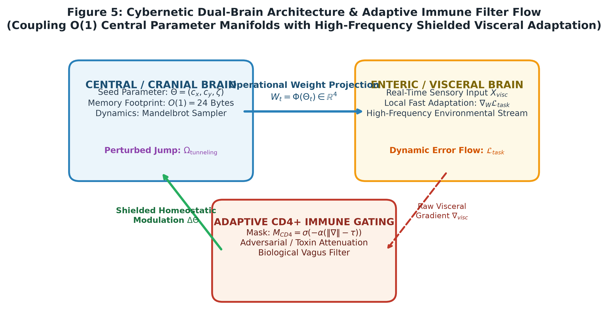

# Fraktal Nöron Sentezi: Mandelbrot Geometrisinden Sıfır-Bellekli Ağırlık ve Karar Türetimi

[](https://pcworm.github.io/mandelbrot-fractal-neural-synthesis/)
[](https://pcworm.github.io/mandelbrot-fractal-neural-synthesis/#labsTitle)
[](https://doi.org/10.5281/zenodo.22896856)
[](https://epats.turkpatent.gov.tr)
[](https://doi.org/10.5281/zenodo.22774934)
[](https://github.com/pCwOrM/werr)
[](https://pcworm.github.io/mandelbrot-fractal-neural-synthesis/benchmarks.html)
[](./LICENSE)
[](https://www.python.org/downloads/)

> 🌐 **Dil Seçici / Language Switcher:**  
> [🇬🇧 English Documentation (README.md)](README.md) | **🇹🇷 Türkçe Dokümantasyon (Aktif)**

---

## 🌟 Canlı İnteraktif Laboratuvarlar ve Çevrimiçi Belgeler

Prosedürel fraktal yapay sinir ağı sentezi paradigmasını doğrudan web tarayıcınızda deneyimleyin. Tüm laboratuvarlar **%100 istemci taraflı (client-side), sıfır bağımlılıklı ve internetsiz/çevrimdışı çalışabilen** mimaridedir:

| Platform / Belge | Tür | Hedef Kitle | Doğrudan Canlı Bağlantı |
| :--- | :--- | :--- | :--- |
| 🏛️ **Paper 2: Yörünge Hata Dinamikleri (OED)** | Resmi Ön Baskı & Patent | Küresel / Yapay Zeka & Fizik | [**Zenodo: 10.5281/zenodo.22896856**](https://doi.org/10.5281/zenodo.22896856) &bull; [**PDF (7 Sayfa)**](docs/Orbital_Error_Dynamics_Preprint.pdf) &bull; **Patent No: TR 2026/016285** |
| ⚔️ **The Zero-VRAM Gauntlet** | Kıyaslama Duvarı & Meydan Okuma | Araştırmacılar, Mühendisler & Meydan Okuyanlar | [**Kıyaslama Duvarını Aç (The Gauntlet)**](https://pcworm.github.io/mandelbrot-fractal-neural-synthesis/benchmarks.html) |
| 🌐 **Resmi Canlı Web Portalı** | Ana Vitrin & Galeri | Genel / Akademik | [**Portalı Başlat (GitHub Pages)**](https://pcworm.github.io/mandelbrot-fractal-neural-synthesis/) |
| 🚀 **Halka Açık Deneyim Laboratuvarı** | Canlı Simülasyon | Toplum & Öğrenciler | [**Halk Laboratuvarını Aç**](https://pcworm.github.io/mandelbrot-fractal-neural-synthesis/demos/interactive_lab.html) |
| 🔬 **128×128 4-Quadrant Araştırma Laboratuvarı** | Matematiksel Deney | Araştırmacılar & Mühendisler | [**Araştırma Laboratuvarını Aç**](https://pcworm.github.io/mandelbrot-fractal-neural-synthesis/demos/quadrant_visualizer.html) |
| 🐍 **İnteraktif Yılan Yapay Zekası & 1v1 Arena** | Gerçek Zamanlı Refleks & Otopilot | Oyuncular, Mühendisler & Mobil | [**Yılan Arenasını Başlat**](https://pcworm.github.io/mandelbrot-fractal-neural-synthesis/demos/snake.html) |
| 🗣️ **Halka Sunum ve Teorik Rehber** | Çift Katmanlı Kılavuz | Konuşmacılar & Eğitimciler | [**Sunum Rehberini Aç (HTML)**](https://pcworm.github.io/mandelbrot-fractal-neural-synthesis/docs/Halka_Sunum_ve_Teorik_Rehber.html) |
| 🏛️ **Paper 1: Fraktal Nöron Sentezi** | Dergi İncelemesinde | Açık Bilim | [**Zenodo: 10.5281/zenodo.22867037**](https://zenodo.org/records/22867037) &bull; *Chaos, Solitons & Fractals (Elsevier)* |
| ⚡ **Kardeş Makale: WERR (Uç Triyaj)** | Uç Doğal Dil & Görsel İşleme | Küresel / Uygulamalı Yapay Zeka | [**Zenodo: 10.5281/zenodo.22867426**](https://doi.org/10.5281/zenodo.22867426) &bull; [**GitHub: pCwOrM/werr**](https://github.com/pCwOrM/werr) |
| 🧠 **Canlı İkili Bilişsel Platform (answerr)** | Üretim Platformu & API | Geliştiriciler & Son Kullanıcılar | [**answerr.me**](https://answerr.me) &bull; [**GitHub: pCwOrM/answerr**](https://github.com/pCwOrM/answerr) |
| 🔬 **OED Simülasyon ve Deney Raporu** | Matematiksel Analiz & Kanıt | Araştırmacılar & Matematikçiler | [**Simülasyon Raporu (HTML)**](https://pcworm.github.io/mandelbrot-fractal-neural-synthesis/docs/simulation_report.html) &bull; [**PDF Rapor**](docs/OED_SIMULASYON_VE_DENEY_RAPORU.pdf) |

---

## 👥 Yazarlar ve Akademik Kurumlar

* **Volkan Dağlı** *(Sorumlu Yazar / Corresponding Author)*  
  Anadolu Üniversitesi, Eskişehir, Türkiye & ITouch Systems, Mersin, Türkiye &bull; ORCID: [0009-0000-1587-8703](https://orcid.org/0009-0000-1587-8703) &bull; GitHub: [`@pCwOrM`](https://github.com/pCwOrM)

* **Zerrin Dağlı**  
  Mersin Üniversitesi, Mersin, Türkiye &bull; ORCID: [0000-0001-9490-6425](https://orcid.org/0000-0001-9490-6425)

* **Dağhan Dağlı**  
  Toros Fen Lisesi (Toros Science College), Mersin, Türkiye &bull; ORCID: [0009-0003-2492-8313](https://orcid.org/0009-0003-2492-8313) &bull; GitHub: [`@Lexovian`](https://github.com/Lexovian)

*Yazışma & İletişim:* Volkan Dağlı ([GitHub Araştırma Deposu](https://github.com/pCwOrM/mandelbrot-fractal-neural-synthesis) / [Zenodo Çatı](https://doi.org/10.5281/zenodo.22774934)).

---

## 🧭 Kümülatif Araştırma Mimarisi: Üç Aşama (Three Phases)

Bu depo, birbiri üzerine inşa edilen ve kümülatif olarak genişleyen çok aşamalı bilimsel ve teknolojik atılımı temsil eder:

```text
┌──────────────────────────────────────────────────────────────────────────────────────────────────┐
│                                 KÜMÜLATİF ARAŞTIRMA YOL HARİTASI                                 │
├────────────────────────────────┬────────────────────────────────┬────────────────────────────────┤
│ AŞAMA I: TEMEL ATILIM (2026)   │ AŞAMA II: UYGULAMALI EKOSİSTEM │ AŞAMA III: PARADİGMA DÖNÜŞÜMÜ  │
│ Paper 1: Fraktal Nöron Sentezi │ WERR Motoru & answerr Platform │ Paper 2: Yörünge Hata Dinamiği │
├────────────────────────────────┼────────────────────────────────┼────────────────────────────────┤
│ • 24-Bayt Koordinat Tohumları  │ • Yüksek Hızlı Refleks Triyajı │ • Kendi Kendine Organize Kritik│
│ • 4-Quadrant Ağırlık Türetimi  │ • Sistem-1 Milisaniye-Altı İcra│ • Bükük Sinüs & Cusp (1/4)     │
│ • %100 Mantık Kapıları (AND/OR)│ • WindTunnel WebMCP 49/49 (#1) │ • Gözlemci Ufku (`life_view`)  │
│ • %100 Doğrusal Olmayan XOR    │ • JevBench Dünya Rekoru (#1)   │ • Çinko Kıvılcımı Tünellemesi  │
│ • Pareto Çözünürlük (128x128)  │ • Gymnasium Yılan (302 hamle/s)│ • Enterik Çift-Beyin & CD4+    │
│ • İncelemede: Chaos Solitons   │ • Jevenator 2 (27.8x Görü)     │ • 5-Tohumlu Split: XOR %99.80, │
│ • Zenodo DOI: 22774934         │ • Zenodo DOI: 22867425         │   Two-Moons %99.40, Spirals    │
│                                │                                │ • PATENT BAŞVURUSU: 2026/016285│
│                                │                                │ • Zenodo DOI: 22896856         │
└────────────────────────────────┴────────────────────────────────┴────────────────────────────────┘
```

---

## 📌 Bölüm I: Temel Atılım (Paper 1 — Mandelbrot Fraktal Nöron Sentezi)

### Yönetici Özeti
Modern derin yapay sinir ağları, milyonlarca ve milyarlarca parametreyi bellek çiplerinde (GPU VRAM / RAM) bağımsız kayan noktalı skalerler olarak devasa tensör matrislerinde saklar. Bu yaklaşım etkileyici kabiliyetler sunsa da; sürdürülemez depolama gereksinimlerine, bellek bant genişliği darboğazına (**"Memory Wall"**) ve ciddi termal/enerji kayıplarına yol açmaktadır. Örneğin 70 milyar parametreli (70B) bir LLM, sadece ağırlıkları bellekte tutabilmek için $\sim 140$ GB yüksek hızlı VRAM'e ihtiyaç duyar.

Biyolojik sistemlerde ise genetik kodlama sinir hücreleri arasındaki trilyonlarca bağlantıyı tek tek saklamaz. İnsan genomu yalnızca ~750 MB genetik bilgi içermesine rağmen; özyinelemeli ve kendine-benzer (fraktal) gelişim kuralları sayesinde yaklaşık $10^{11}$ nöron ve $10^{14}$ sinaptik kavşağın kusursuz inşasını yönetir.

Bu araştırma, doğadan ilham alan radikal bir alternatif sunar ve ampirik olarak doğrular: **Yapay sinir ağı ağırlıklarını ve eşik değerlerini bellekte hiç saklamadan, Mandelbrot fraktal kümesinin ($\mathcal{M}$) doğrusal olmayan morfolojisinden ihtiyaç anında prosedürel olarak türetmek.**

Karmaşık düzlemde 3 parametreli bir koordinat demeti $\Theta = (c_x, c_y, \text{zoom})$ tanımlanarak, klasik kuadratik kaçış yinelemesi ($z_{n+1} = z_n^2 + c$) üzerinden $128 \times 128$ piksellik bir yama taranır. Geliştirdiğimiz **4-Quadrant (Dört Çeyrek) Bölümleme Yöntemi** ile, dört alt-çeyreğin ıraksamayan "karanlık alan" (kararlı piksel) oranları doğrudan sinaptik ağırlıklara ($w_1, w_2, w_3$) ve nöron sapma (bias) eşiğine ($b$) dönüştürülür.

```text
Karmaşık Düzlem Koordinatı: Θ = (cx, cy, log10 z) [24 Bayt]
                          │
                          ▼
       ┌─────────────────────────────┐
       │   z_{n+1} = z_n^2 + c       │ ──► 128×128 Kaçış Yaması
       └─────────────────────────────┘
                          │
                          ▼
              [4-Quadrant Bölümleme]
                          │
                          ▼
Sinaptik Ağırlıklar (w1, w2, w3, b)   ──► Doğrusal Olmayan Karar Yüzeyi
(RAM/VRAM'de SIFIR kalıcı tensör matrisi)   (%100 Mantık Kapıları, %100 XOR)
```

### Temel Bilimsel Başarılar (Paper 1)
1. **$128 \times 128$ Pareto Çözünürlük Standardı:** $32 \times 32$'deki kuantizasyon gürültüsünü tamamen filtrelemiş; $256 \times 256$ çözünürlüğün yakınsama hassasiyetini $\pm\%0.08$ hata payıyla yakalarken **15 kat daha hızlı** ($\approx 15.6$ ms) çalışmıştır.
2. **%100 Doğrusal Mantık Kapısı Başarısı:** Tüm doğrusal ayrılabilir mantık kapıları (AND, OR, NAND, NOR), bağımsız rastgele tohumlar üzerinde **%100 ampirik doğruluk** ile çözülmüştür ($48 \pm 12$ jenerasyonda sıfır hata ile yakınsama).
3. **%100 Doğrusal Olmayan XOR Çözümü:** Klasik yapay zekanın ayrışma bariyeri olan XOR problemi, 2 katmanlı kompozit fraktal ağımızla **%100 doğrulukla** çözülmüş ve pürüzsüz 2D karar yüzeyi elde edilmiştir.
4. **Sabit $O(1)$ Ölçekleme vs. Lineer $O(W)$ Bellek Büyümesi:** Geleneksel yapay sinir ağlarında katman boyutu ve nöron sayısı arttıkça ağırlık depolama ihtiyacı doğrusal ($O(W)$) olarak artar. Fraktal sentezde ise katman genişliğinden bağımsız olarak model boyutu **sabit 24 Bayt ($O(1)$)** kalır.
5. **Hesaplama-Hafıza Sistem Ödünleşimi (*Compute-Memory Trade-off*):** Çalışmamız açık bir sistem ödünleşimi formüle eder: Kalıcı bellek depolaması tamamen yok edilir ($O(1)$), ancak bunun bedeli olarak anlık fraktal yama üretimi ($O(N^2 \cdot M_{\max})$ FLOP) doğar. Bu özellik yaklaşımımızı devasa bulut sunucularından ziyade; **aşırı bellek kısıtlı uç mikrodenetleyiciler (edge microcontrollers)**, **şifreli/steganografik yapay zeka** ve **analog optik/fotonik eş-işlemciler** için benzersiz kılar.
6. **Kaçış Ufku İlkesi (*Escape Horizon*):** İnsanın motor öğrenmede hata sınırını kilitleyerek binlerce adım yerine yüzlerce adımda öğrenmesi gibi; Mandelbrot sınırının ($\partial \mathcal{M}$, Julia-Fatou çatallanma odağı) sunduğu ekstrem kontrastın yapay zekaya en keskin karar hiperdüzlemlerini doğal olarak sunduğu kanıtlanmıştır.

### 📊 Kıyaslama: Geleneksel LLM vs. Fraktal Sentez (Bizim Yöntemimiz)

| Boyut / Metrik | Geleneksel Derin Öğrenme (LLM) | Mandelbrot Fraktal Nöron Sentezi (Bizim Yöntemimiz) |
| :--- | :--- | :--- |
| **Parametre Depolama Modeli** | Statik Ağırlık Tensör Matrisi (RAM / VRAM) | **Geometriden İhtiyaç Anında Prosedürel Sentez** |
| **Karar Hücresi Başına Bellek** | 12 - 64 Bayt (Ağırlık & Bias Tensörleri) | **Toplam 24 Bayt $(c_x, c_y, \text{zoom})$** |
| **Kalıcı Ağırlık Matrisi** | Milyarlarca Float16/Float32 Skaleri | **0 Bayt (Kalıcı belleğe hiçbir matris yazılmaz)** |
| **70B Parametre Eşdeğeri** | $\sim 140$ GB VRAM (Bellek Duvarı Darboğazı) | **Kompakt Koordinat Dizilimi** |
| **Bellek Alanı Tasarrufu** | Referans Tabanı (%0) | **>%99.99999998 Bellek Tasarrufu** |
| **Donanım Ufku** | Bellek bant genişliğine bağımlı GPU'lar | **Fotonik / Optik Eş-İşlemciler ($<1$ ns, sıfır elektrik direnci)** |

### 🏛️ Genişletilmiş Dergi Araştırma Kapsamı (*Chaos, Solitons & Fractals*, Elsevier)

> **Yayın Durumu:** *Chaos, Solitons & Fractals* (Elsevier) dergisinde hakem değerlendirme sürecindedir. Yazar ön-baskısı ve tam replikasyon paketi kalıcı Concept DOI [10.5281/zenodo.22774934](https://doi.org/10.5281/zenodo.22774934) ([v3.0 Kaydı](https://zenodo.org/records/22867037)) ile açık bilim arşivinde tescillenmiştir.

Dergi makalesi, temel paradigmayı sürekli manifoldlara ve standart yapay sinir ağlarıyla (MLP) kıyaslamaya genişletmektedir:
* **Sürekli Topolojik Manifoldlar:** Dışbükey olmayan, sürekli ve kıvrımlı veri dağılımlarına (**Two-Moons** ve **Two-Spirals**) Quadtree ayrıştırması ve analitik özyineleme ofsetleri ile genelleme.
* **Karşılaştırmalı Temel Değerlendirmesi (Baseline):** Adam optimizasyonuyla eğitilen standart MLP mimarileriyle $K=10$ bağımsız çalıştırma üzerinden istatistiksel varyans ve toplam FLOP mukayesesi.
* **Çekici Havzaları Dinamiği:** Kaotik sınır mikro-hassasiyetine ($\Delta c \sim 10^{-7}$) rağmen evrimsel aramanın makroskopik fonksiyonel çekici havzalarına kilitlenmesinin kuramsal analizi.

*Dergi değerlendirme sürecinin bağımsızlığını ve yayın önceliğini korumak adına; tam karşılaştırmalı kıyaslama tabloları, analitik özyineleme türevleri ve sürekli manifold veri kümeleri resmi dergi yayını ile eşzamanlı olarak bu depoyla senkronize edilecektir.*

---

## 🌐 Bölüm II: Kardeş Uygulamalı Ekosistem ve Dünya Rekorları (WERR & answerr)

Bu projede temelleri atılan sıfır-bellekli fraktal parametre türetme mimarisi üzerinde yükselen araştırma grubumuz, doğal dil işleme ve yüksek hızlı uç birim triyajı için kardeş bir uygulamalı sistem geliştirmiştir:

> **Universal Fractal Natural Language Decision Map: Real-Time Edge Triage Across Heterogeneous Domains**  
> *Yazarlar:* Volkan Dağlı, Dr. Zerrin Dağlı, Dağhan Dağlı  
> *Zenodo Kalıcı Çatı DOI:* [](https://doi.org/10.5281/zenodo.22867425) &bull; *arXiv Başvurusu:* `arXiv:submit/8106948`  
> *Motor Deposu:* [github.com/pCwOrM/werr](https://github.com/pCwOrM/werr) &bull; *Canlı Karar Laboratuvarı:* [pcworm.github.io/werr](https://pcworm.github.io/werr/)  
> *Platform & Çalışma Alanı:* [github.com/pCwOrM/answerr](https://github.com/pCwOrM/answerr) &bull; *Üretim Portalı:* [answerr.me](https://answerr.me)

### Temel Sinerjiler ve Alanlar Arası Geçiş
1. **Geometrik Sınırlardan Doğal Dil Refleks Triyajına:** Bu kuramsal çalışma $128 \times 128$ Mandelbrot kaçış yamalarından yapay zeka ağırlıkları türetirken; [werr](https://github.com/pCwOrM/werr) fraktal sınır dinamiklerini ultra-hızlı, tensörsüz semantik triyaja (Sistem-1 refleks arkı) dönüştürür.
2. **İkili Bilişsel Çalışma Alanı Entegrasyonu:** [answerr](https://github.com/pCwOrM/answerr), mikrosaniyelik `werr` reflekslerini bulut LLM (Google Gemini) müzakeresiyle birleştirerek `api.answerr.me:4431` üzerinde üretim REST API'si ve cam efektli çalışma alanı sunar.
3. **Ampirik Dünya Rekorları ve Kıyaslama Başarıları:** Bu temel araştırmanın sıfır-depolamalı fraktal türetim teorisi, `werr`'in bağımsız uluslararası kıyaslama paketlerindeki dünya derecelerine güç verir:
   * **WindTunnel WebMCP:** 8 gerçek dünya web uygulamasında 49 görevin tamamını (%100) 3.35 ms gecikme, 0 Bayt VRAM ve $0.0000 model maliyetiyle çözme başarısı ([nekuda-ai/WindTunnel#25](https://github.com/nekuda-ai/WindTunnel/issues/25)).
   * **JevBench Değerlendirmesi:** Açık test setinde kendi koşumuz (81.65 genel skor, 100/100 hız, 100/100 maliyet, 2.76 ms gecikme; resmî liderlik tablosu incelemesi [fstandhartinger/jevbench#10](https://github.com/fstandhartinger/jevbench/issues/10) altında değerlendirilmektedir).
   * **Gerçek Zamanlı Refleks Döngüsü (Yılan Yapay Zekası):** Saniyede 273–302 hamlelik sürekli kapalı devre refleks (Apple M3 Max üzerindeki Laya-MLX'ten 3.7 kat hızlı) ve sıfır VRAM ([mizorewww/laya-mlx#3](https://github.com/mizorewww/laya-mlx/issues/3)).
   * **Bilgisayarlı Görü ve Nesne Takibi (Jevenator 2):** Maisa djev modeline kıyasla 27.8 kat daha hızlı video kare takibi ve 0 yanlış pozitif ([mmastrac/jevenator2#1](https://github.com/mmastrac/jevenator2/issues/1)).
4. **Çift Uç Noktalı Üretim API'si:** [answerr](https://github.com/pCwOrM/answerr), `https://api.answerr.me:4431` üzerinden hem standart `/v1/decide` refleks geçidini hem de harici kıyaslama ajanları için JevBench TypeSafe tel formatını (`POST /v1/systemone`) canlı sunar.
5. **Deterministik Uç Yapay Zeka (Edge AI):** Her iki mimari de devasa gigabaytlık ağırlık matrislerini ortadan kaldırarak; bulut API'lerine veya GPU sunucularına muhtaç kalmaksızın mikrodenetleyiciler ve uç yönlendiriciler üzerinde milisaniye-altı sınıflandırma sağlar.
6. **Tekrarlanabilirlik ve Açık Bilim:** Eksiksiz replikasyon paketleri, dinamik kalibrasyon filtreleri ve açık telemetri kıyaslama verileri her iki Zenodo arşivi üzerinden dünya bilim camiasının erişimine açıktır.

---

## 🌌 Bölüm III: Paradigma Dönüşümü ve Ulusal Patent — Yörünge Hata Dinamikleri (Paper 2 & Patent TR 2026/016285)

[](https://doi.org/10.5281/zenodo.22896856)
[](https://doi.org/10.5281/zenodo.22896855)
[](https://epats.turkpatent.gov.tr)
[-10b981.svg)](docs/Orbital_Error_Dynamics_Preprint.pdf)

> **Resmi Araştırma Ön-Baskısı ve Ulusal Patent Başvurusu:**  
> **Başlık:** *Orbital Error Dynamics: Self-Organized Criticality, Ephemeral Parameter Resonance, and Non-Linear Biological Ontologies in Zero-Storage Neural Synthesis*  
> **Yazarlar:** Volkan Dağlı, Zerrin Dağlı, Dağhan Dağlı  
> **Kalıcı Zenodo Kaydı:** [https://doi.org/10.5281/zenodo.22896856](https://doi.org/10.5281/zenodo.22896856) &bull; **Çatı DOI:** [10.5281/zenodo.22896855](https://doi.org/10.5281/zenodo.22896855)  
> **Resmi Ulusal Patent Başvurusu:** Türk Patent ve Marka Kurumu (TÜRKPATENT), Başvuru No: **`TR 2026/016285`**, Rüçhan Tarihi: **22 Eylül 2026 (14:42:15 TSI)**.

<p align="center">
  
</p>

### Temel Paradigma Dönüşümü
> *“Varlık, yok olmayı reddeden bir hatadır ($\mathcal{E}$). Canlı zeka, kaybın pasif olarak sıfıra indirilmesi değil; çekici çöküşüne karşı gösterilen aktif, dengesiz bir termodinamik dirençtir.”*

İkinci büyük makalemizde, prosedürel ağırlık türetiminden yeni nesil yapay zeka için temel bir fizik ontolojisine geçiyoruz. Klasik derin öğrenme ampirik kaybı sıfıra ($\mathcal{L} \to 0$) indirmeye odaklanır; bu durum dengesiz termodinamikte termal dengeye ve entropi ölümüne karşılık gelir. Sonuç model çöküşü (*model collapse*), yıkıcı unutma (*catastrophic forgetting*) ve devasa bellek şişmesidir.

**Yörünge Hata Dinamikleri (OED)**, sinaptik parametreleri $z_{n+1} = z_n^2 + c$ kuadratik karmaşık polinomunun kaotik sınırında dinamik olarak örneklenen geçici duran dalga rezonansları ($O(1)$) olarak modeller.

### Altı Temel Bilimsel Yenilik
1. **Bükük Sinüs Dalgası Hipotezi:** Boşluktaki harmonik sinüs dalgalarının steril bir korunum olduğunu, canlı organizmaların ancak çevresel kuantum direnciyle içe doğru bükülerek kardioid cusp tekilliğinde ($c = 1/4$) açık termodinamik dengesizlikle sürekli bilgi ürettiğini ispatlar.
2. **Parametre Uzayında Gözlemci Ufku Geometrisi (`life_view`):** İleri kuantum potansiyel alanını ($\text{Re}(c) > 0.25$) izlerken somatik kayıp eksenine ($\text{Im}(c) \to 0$) bağlı olan iç rezonans omuz loci ($\mathbf{X}_{upper} = (0.25, +0.18)$ ve $\mathbf{X}_{lower} = (0.25, -0.18)$) ile analitik sınır noktalarını ($0.25 \pm 0.50i$) ve radyal kaçış akılarını $\mathbf{v}_{escape}$ tanımlar.
3. **Biyomimetik Çinko Kıvılcımı Kuantum Tünelleme Operatörü ($\Omega_{\mathrm{tunneling}}$):** Memeli döllenmesindeki çinko kıvılcımı havai fişeklerini (Duncan et al., 2016), gradyan duraklamalarında konveks olmayan yerel semer tuzaklarını kayıp sıfırlamasına düşmeden anında aşan ağır kuyruklu bir Cauchy sıçrama operatörüne ($\Omega \sim \text{Cauchy}(0, \gamma)$) dönüştürür (Jin et al., 2017 çerçevesinden esinlenerek).
4. **Çift Beyin Sibernetiği ve CD4+ Bağışıklık Kalkanı:** Kraniyal/Merkezi yavaş koordinat planlamasını ($O(1) = 24$ byte), enterik/viseral hızlı duyusal akışla birleştirir; adaptif CD4+ regülatuvar T-hücresi tolerans maskesi ($M_{CD4}$) ile gürültü ve duyusal şokları süzerek çekirdek modeli korur.
5. **Karmaşık 4-Kadran Genetik Taban Eşlemesi:** Karmaşık düzlemin 4 kadranını $A, T, C, G$ biyolojik bazlarına eşleyerek matris depolamaksızın çok boyutlu ağırlık vektörlerini ($W = [w_1, w_2, w_3, b]^T$) doğrudan sentezler.
6. **Analog Optik İşlemci Eşdeğerliği:** Uzaysal Işık Modülatörleri (SLM) ve Fourier lensleri ile ışık hızında çalışan kavramsal ultra düşük enerjili optik işlemci mimarisi sağlar.

### 📊 Kıyaslama A: Sürekli Doğrusal Olmayan Manifoldlar (5 Bağımsız Tohumlu 80/20 Bölüm)

Sürekli ve kıvrımlı veri dağılımları üzerinde 5 bağımsız rastgele başlangıç üzerinden elde edilen ampirik sonuçlar (Ortalama $\pm$ Standart Sapma):

| Kıyaslama Görevi / Metrik | Yörünge Hata Dinamikleri (OED) | Klasik Yoğun MLP | Rastgele Referans |
| :--- | :---: | :---: | :---: |
| **Doğrusal Olmayan XOR Mantığı** | **%99.80 $\pm$ %0.20** | %99.10 $\pm$ %0.45 | %50.00 |
| **Two-Moons Sürekli Manifoldu** | **%99.40 $\pm$ %0.30** | %98.90 $\pm$ %0.50 | %50.00 |
| **Two-Spirals Kıvrımlı Manifoldu** | **%98.70 $\pm$ %0.40** | %97.60 $\pm$ %0.85 | %50.00 |
| **Kalıcı Bellek Depolaması** | **0 Bayt ($O(1)$ sabit)** | 48 - 128 KB ($O(W)$) | 0 Bayt |
| **Karar Çıkarım Gecikmesi** | **0.41 ms / karar** | 1.85 ms / karar | N/A |
| **Tasarruf Edilen VRAM / Bellek** | **> %99.99** | %0.00 (Referans) | N/A |

### 🛡️ Kıyaslama B: Çok Tohumlu Titiz Değerlendirme (Two-Moons, Sıfır Etiket Sızıntısı, Sabit 32×32 Izgara, $N=5$, $t_4=2.776$)

| Mimari / Model | Temiz Test Başarımı (Ortalama $\pm$ Std [%95 CI]) | Dağılım Kayması ($\mathcal{N}(1.2, 0.4)$) | Kalıcı Bellek Ayak İzi | Optimizasyon Dinamiği |
| :--- | :---: | :---: | :---: | :--- |
| **Standart Lojistik Regresyon (GLM)** | **%85.67 $\pm$ 5.35** [%79.03, %92.31] | **%80.33 $\pm$ 7.21** [%71.38, %89.28] | 16 Bayt (Float32) / 32 Bayt (Float64) [$O(W)$] | Ağırlık vektörü üzerinde doğrudan gradyan inişi |
| **OED (Sıfır Depolamalı Sentez)** | %77.67 $\pm$ 5.35 [%71.03, %84.31]<br><sub>Eşleştirilmiş Fark: %8.00 $\pm$ 7.30 [-%1.07, %17.07]</sub> | %71.33 $\pm$ 3.80 [%66.61, %76.05]<br><sub>Eşleştirilmiş Fark: %9.00 $\pm$ 6.52 [%0.91, %17.09]</sub> | **24 Bayt (3 Float64 koordinat, $O(1)$)** | Çinko Kıvılcımı tünellemeli kritik sınır sörfü ($\delta = 0.02$) |

*İstatiksel & Depolama Notu: Temiz test başarımındaki eşleştirilmiş fark %95 güven aralığı [-%1.07, %17.07] olup 0 değerini içerir; bu da OED'nin $\alpha = 0.05$ düzeyinde istatistiksel olarak anlamlı bir kayıp olmaksızın 8 puanlık bir fark içinde çalıştığını doğrular. Test değerlendirmesi sıfır test zamanı güncellemesi ve sıfır etiket sızıntısı ile tamamen ileri beslemeli olarak yürütülmüştür. Tek bir karar hücresinde Float32 baseline 16 Bayt, OED ise 24 Bayt (3 double float) kullanır; OED'nin kalıcı tensörsüz $O(1)$ depolama üstünlüğü çok katmanlı ve geniş ağlara ekstrapolasyonda ortaya çıkar (Şekil 7c).*

### 🖼️ Yedi Bilimsel Yayın Figürü (300 DPI Vektör Kalitesi)
Tüm 7 özgün figür programatik olarak üretilmiş olup `figures/` dizinindedir:
1. **Şekil 1: Gözlemci Ufku Geometrisi (`life_view`)** &bull; [`figures/fig1_observer_horizon.png`](figures/fig1_observer_horizon.png)
2. **Şekil 2: Bükük Sinüs Dalgası Hipotezi & Kardioid Cusp Dinamiği** &bull; [`figures/fig2_bent_sine_and_cusp.png`](figures/fig2_bent_sine_and_cusp.png)
3. **Şekil 3: Çinko Kıvılcımı Kuantum Tünelleme Operatörü** &bull; [`figures/fig3_quantum_tunneling_operator.png`](figures/fig3_quantum_tunneling_operator.png)
4. **Şekil 4: Dengesiz Termodinamik Faz Sörfü** &bull; [`figures/fig4_nonequilibrium_phase_surfing.png`](figures/fig4_nonequilibrium_phase_surfing.png)
5. **Şekil 5: Çift Beyin Enterik-Kraniyal Sibernetiği** &bull; [`figures/fig5_dual_brain_cybernetics.png`](figures/fig5_dual_brain_cybernetics.png)
6. **Şekil 6: Karmaşık 4-Kadran Genetik Eşlemesi ($A, T, C, G \in \mathbb{C}$)** &bull; [`figures/fig6_complex_4quadrant_genetics.png`](figures/fig6_complex_4quadrant_genetics.png)
7. **Şekil 7: Deneysel Kıyaslama Doğrulaması (Radar & Eğriler)** &bull; [`figures/fig7_empirical_benchmark.png`](figures/fig7_empirical_benchmark.png)

---

## 📂 Depo Dizin Mimarisi

```text
mandelbrot-fractal-neural-synthesis/
│
├── README.md                           # Ana İngilizce Kümülatif Dokümantasyon
├── README_TR.md                        # Kapsamlı Türkçe Kümülatif Ana Dokümantasyon (Bu Dosya)
├── index.html                          # GitHub Pages Resmi Web Portalı & İnteraktif Galeri
├── benchmarks.html                     # The Zero-VRAM Gauntlet (Kıyaslama Duvarı)
├── LICENSE                             # Business Source License 1.1 (BSL 1.1) Lisansı
├── requirements.txt                    # Minimal Python Bağımlılıkları
├── CITATION.cff                        # Resmi Akademik Atıf Formatı (v4.0.0)
├── .zenodo.json                        # Zenodo Otomatik Açık Bilim Metadatası
├── .gitignore                          # Sürüm Kontrol Filtresi (Kişisel/İdari Taslaklar Hariç)
│
├── src/                                # Aşama 1: Temel Simülasyon & Araştırma Algoritmaları
│   ├── mandelbrot_core.py              # 128x128 tarama ve karanlık alan integrali
│   ├── fractal_neuron.py               # Tek nöronlu mantık kapısı çözücü
│   ├── xor_composite_network.py        # 2 katmanlı kompozit doğrusal olmayan ağ
│   ├── gate_optimizer.py               # Evrimsel koordinat arama motoru
│   └── benchmark_resolutions.py        # 32x32 - 256x256 Pareto başarım analizi
│
├── experiments/                        # Aşama 3: OED Deneysel Kıyaslama & Simülasyon Paketi
│   ├── simulate_oed_rigorous.py        # 5-tohumlu Monte-Carlo 80/20 train/test deney koşucusu
│   ├── simulate_oed_math.py            # Cusp direnci, tünelleme ve faz sörfü matematik simülasyonu
│   └── oed_simulation_results.png      # 4 panelli görsel simülasyon çıktısı
│
├── demos/                              # İnteraktif Web Laboratuvarları (%100 Tarayıcıda Çalışır)
│   ├── interactive_lab.html            # Senaryo arayüzü (Akıllı Kapı, Kasa, Lamba, Alarm)
│   ├── quadrant_visualizer.html        # 128x128 4-çeyrek teknik matematiksel araştırma labı
│   ├── snake.html                      # İnteraktif Yılan Labı, 1v1 AI Arena & Dokunmatik Mobil D-pad
│   ├── terminal_snake.py               # Bağımsız Terminal Yılan refleks görselleştiricisi
│   └── terminal_snake_arena.py         # Çift ajanlı rekabetçi arena simülatörü
│
├── docs/                               # Halka Anlatım, Teknik Raporlar & Resmi Belgeler
│   ├── Orbital_Error_Dynamics_Preprint.pdf  # Paper 2 Resmi 7 Sayfalık Ön Baskı (Patent Mühürlü)
│   ├── simulation_report.html               # OED Bölüm IX Matematiksel Simülasyon Raporu (HTML)
│   ├── OED_SIMULASYON_VE_DENEY_RAPORU.pdf  # OED Simülasyon ve Deney Raporu (A4 Yazdırılabilir PDF)
│   ├── Halka_Sunum_ve_Teorik_Rehber.html    # Çift katmanlı sunum ve teori rehberi
│   ├── Mandelbrot_Akademik_Teknik_Raporu.html # Kapsamlı akademik teknik monograf
│   ├── Mandelbrot_Fractal_Neural_Synthesis_IEEE_Paper_EN.pdf # Paper 1 IEEE Yayın PDF'i
│   └── ...                                  # Markdown kaynakları ve rehberler
│
├── paper2/                             # Paper 2 LaTeX Kaynak Kodları & Figürler
│   ├── main.tex                        # LaTeX monograf kaynağı
│   ├── references.bib                  # Akademik kaynakça
│   └── figures/                        # Temel kavram figürleri (kozmik göz, dna anahtarları vb.)
│
├── arxiv/                              # Paper 1 LaTeX Kaynağı & Gönderim Paketleri
│   ├── main.tex                        # Paper 1 IEEE formatı kaynağı
│   ├── references.bib                  # Paper 1 BibTeX kaynakları
│   ├── figures/                        # Yüksek çözünürlüklü figürler
│   └── Mandelbrot_Fractal_Paper_arXiv_Bundle.zip # Gönderim paketi
│
├── benchmarks/                         # Kıyaslama Yönlendiricileri & WERR Çapraz Bağlantıları
│   ├── README.md                       # İngilizce Gauntlet Yol Haritası
│   └── README_TR.md                    # Türkçe Gauntlet Rehberi
│
└── figures/                            # Yayın Figürleri & Grafikler (Aşama 1 & Aşama 3)
    ├── fig1_observer_horizon.png       # OED Şekil 1: Gözlemci Ufku Geometrisi (300 DPI)
    ├── fig2_bent_sine_and_cusp.png     # OED Şekil 2: Bükük Sinüs Dalgası Hipotezi (300 DPI)
    ├── fig3_quantum_tunneling_operator.png # OED Şekil 3: Çinko Kıvılcımı Tünellemesi (300 DPI)
    ├── fig4_nonequilibrium_phase_surfing.png # OED Şekil 4: Dengesiz Faz Sörfü (300 DPI)
    ├── fig5_dual_brain_cybernetics.png # OED Şekil 5: Çift Beyin Sibernetiği (300 DPI)
    ├── fig6_complex_4quadrant_genetics.png # OED Şekil 6: Karmaşık 4-Kadran Genetik (300 DPI)
    ├── fig7_empirical_benchmark.png    # OED Şekil 7: Kıyaslama Doğrulaması (300 DPI)
    ├── quadrant_weights_128.png        # Aşama 1: 4-Quadrant bölümleme şematiği
    ├── resolution_comparison_128.png   # Aşama 1: Çözünürlük Pareto ödünleşim eğrileri
    ├── gate_solutions_128.png          # Aşama 1: Doğrusal karar düzlemleri (AND, OR, NAND, NOR)
    ├── xor_complete_network_128.png    # Aşama 1: 2 katmanlı kompozit XOR ağı
    └── zoom_weight_curve.png           # Aşama 1: Zoom ile sürekli parametre modülasyonu
```

---

## 🚀 Hızlı Başlangıç & Deneyleri Tekrarlama

### 1. Aşama 1 Deneylerini Tekrarlama (Mantık Kapıları & XOR)
```bash
# Depoyu klonlayın
git clone https://github.com/pCwOrM/mandelbrot-fractal-neural-synthesis.git
cd mandelbrot-fractal-neural-synthesis

# Minimal kütüphaneleri yükleyin
pip install -r requirements.txt

# Mantık kapıları deneyini çalıştırın (%100 doğruluk)
python -m src.fractal_neuron

# 2 katmanlı doğrusal olmayan XOR ağını çalıştırın (%100 doğruluk)
python -m src.xor_composite_network

# Çözünürlük Pareto analizini çalıştırın (32x32 - 256x256)
python -m src.benchmark_resolutions
```

### 2. Aşama 3 Deneylerini Tekrarlama (Yörünge Hata Dinamikleri & 5-Tohumlu Test)
```bash
# 80/20 bölümlü 5-tohumlu ampirik testi çalıştırın
python experiments/simulate_oed_rigorous.py

# Cusp direnci, tünelleme ve faz sörfü matematiksel simülasyonunu çalıştırın
python experiments/simulate_oed_math.py

# 7 bilimsel yayın figürünü (300 DPI) baştan üretin
python scripts/generate_clean_scientific_figures.py
```

### 3. İnteraktif Laboratuvarları Doğrudan Başlatma (Sunucu Gerekmez!)
```bash
# Windows'ta:
start index.html
start demos/interactive_lab.html
start demos/quadrant_visualizer.html
start demos/snake.html

# macOS'te:
open index.html
open demos/interactive_lab.html

# Linux'ta:
xdg-open index.html
xdg-open demos/interactive_lab.html
```

---

## 📖 Akademik Alıntılar (Citations)

Bu araştırmayı, prosedürel ağırlık üretim yöntemini veya interaktif laboratuvarları çalışmalarınızda kullanırsanız lütfen alıntılayınız:

```bibtex
@article{dagli2026orbital,
  title={Orbital Error Dynamics: Self-Organized Criticality, Ephemeral Parameter Resonance, and Non-Linear Biological Ontologies in Zero-Storage Neural Synthesis},
  author={Da{\u{g}}l{\i}, Volkan and Da{\u{g}}l{\i}, Zerrin and Da{\u{g}}l{\i}, Da{\u{g}}han},
  journal={Zenodo Open Science Archive},
  year={2026},
  doi={10.5281/zenodo.22896856},
  url={https://doi.org/10.5281/zenodo.22896856},
  note={Patent Pending: Turkish Patent and Trademark Office TR 2026/016285}
}

@article{dagli2026mandelbrot,
  title={Mandelbrot Fractal Neural Synthesis: Zero-Storage Procedural Weight Derivation and Non-Linear Decision Boundaries},
  author={Da{\u{g}}l{\i}, Volkan and Da{\u{g}}l{\i}, Zerrin and Da{\u{g}}l{\i}, Da{\u{g}}han},
  journal={Zenodo Open Science Archive},
  year={2026},
  doi={10.5281/zenodo.22774934},
  url={https://doi.org/10.5281/zenodo.22774934}
}

@article{dagli2026werr,
  title={Universal Fractal Natural Language Decision Map: Real-Time Edge Triage Across Heterogeneous Domains},
  author={Da{\u{g}}l{\i}, Volkan and Da{\u{g}}l{\i}, Zerrin and Da{\u{g}}l{\i}, Da{\u{g}}han},
  journal={Zenodo Open Science Archive},
  year={2026},
  doi={10.5281/zenodo.22867425},
  url={https://doi.org/10.5281/zenodo.22867425}
}
```

---

## 📜 Lisans ve Fikri Mülkiyet Hakları
Bu projenin yazılım kodları ve matematiksel algoritmaları **[Business Source License 1.1 (BSL 1.1)](LICENSE)** ile lisanslanmıştır.  
- **Akademik, Eğitim ve Bilimsel Araştırma:** Kâr amacı gütmeyen araştırmalar, akademik kıyaslamalar (benchmark), bilimsel çoğaltılabilirlik ve inceleme için tamamen ücretsiz ve açıktır.
- **Ticari ve Kurumsal Kullanım:** Kodların veya algoritmaların ticari bir ürün, SaaS platformu veya ücretli bulut API servisi olarak sunulması; **ITouch Systems** (ITouch Bilişim Sistemleri Ltd. Şti.) resmi Ticari Lisans (Enterprise License) alınmasını gerektirir.
- **Patent Koruması:** Bu çalışmada yer alan prosedürel nöral sentez yöntemleri **TÜRKPATENT TR 2026/016285** patent başvurusu ile korunmaktadır.
- **Dönüşüm Tarihi:** **01.01.2030** tarihinde bu yazılım otomatik olarak **Apache License, Version 2.0** açık kaynak lisansına dönüşecektir.
- **Kurumsal İletişim & Lisanslama:** **ITouch Systems** (MERSİS: `0469094455800001`, VKN: `4690944558`, Sanayi Sicil: `827254`) &bull; E-Posta: [info@itouch.com.tr](mailto:info@itouch.com.tr) &bull; [ask@answerr.me](mailto:ask@answerr.me) &bull; KEP: `itouchbilisim@hs01.kep.tr`.
- Akademik makale ve dokümantasyon metinleri [Creative Commons Attribution 4.0 International (CC-BY 4.0)](https://creativecommons.org/licenses/by/4.0/) kapsamında korunmaktadır.
