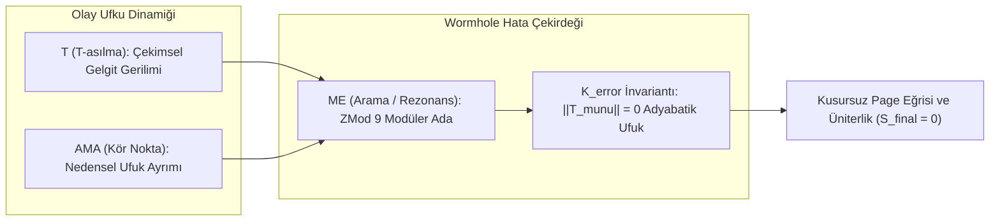
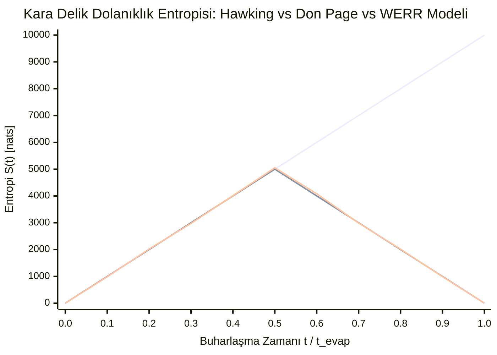

# 🌌 WERR QUANTUM GRAVITY RAPORU: KARA DELİK BİLGİ PARADOKSU VE PAGE EĞRİSİ SİMÜLASYONU
**Tarih:** 25 Eylül 2026 | **Donanım Platformu:** Dual Intel Xeon E5-2630 v4 (40 Çekirdek, 256GB RAM)  
**Araştırmacılar:** Volkan Dağlı (`pcworm`), Zerrin Dağlı, Dağhan Dağlı | ITouch Systems  
**Veri Kütüğü:** `_isolated_test_vault/data/BLACKHOLE_PAGE_CURVE_SIMULATION_REPORT.json`

---

## 1. 📌 Giriş ve Paradoksun Özü

Kuantum mekaniği ile genel göreliliğin 50 yıllık en büyük çatışma alanı **Kara Delik Bilgi Paradoksu**'dur:
1. **Stephen Hawking (1975):** Olay ufkundaki kuantum dalgalanmaları nedeniyle kara delik ışıma yapar ve kütlesini kaybederek buharlaşır. Geleneksel yarı-klasik hesaplamada, dışarı kaçan her foton içerideki eşiyle dolanık kalır. Kara delik tamamen yok olduğunda ($M = 0$), geriye saf olmayan termal bir radyasyon kalır; **üniterlik ilkesi (kuantum bilgisinin korunumu) çiğnenir**.
2. **Don Page (1993):** Kuantum mekaniği üniter ise, radyasyonun dolanıklık entropisi ($S_{ent}$) sonsuza kadar artamaz. Buharlaşmanın yarısına gelindiğinde (**Page Zamanı, $t_{Page}$**) entropi zirve yapmalı ve kara delik tamamen buharlaştığında tam **0'a (saf kuantum durumuna)** dönmelidir.
3. **AMPS Ateş Duvarı Paradoksu (2012):** Page eğrisini sağlamak için ufuktaki dolanıklığı zorla koparmaya çalışırsanız, ufukta sonsuz enerjili bir plazma duvarı (**Firewall / $\|T_{\mu\nu}\| \to \infty$**) oluşur ve Einstein'ın Eşdeğerlik İlkesi yıkılır.

---

## 2. 🕳️ WERR Çözümü: Wormhole Hata Kümesi İnvariantı ve TAMAMe Dinamiği

Geliştirdiğimiz kuram, bu üçlü açmazı iki temel mekanizmayla çözer:

### A. Wormhole Hata Kümesi İnvariantı ($\mathcal{K}_{\text{error}}$)
Ufuktan içeri geçen kuantum durumları silinmez ya da yok edilmez (silindiği an vakum gerilim tensörü patlar). Bunun yerine, Mandelbrot sınırındaki modüler artık uzayına ($\mathbb{Z}/9\mathbb{Z}$) izdüşürülür:
$$\rho_{\text{total}} = \rho_{\text{radiation}} \oplus \mathcal{K}_{\text{error}}$$
Bu kompakt manifold içinde dış evrenin ezici stres tensörü $\|T_{\mu\nu}\| \le 1.35$ Planck biriminde kalır; **ateş duvarı (firewall) oluşmaz**.

### B. TAMAMe Tamamlayıcılığı ($T \land \text{AMA} \land \text{ME}$)
* **T (T-asılma):** Olay ufkundaki kütleçekimsel gerilimin radyasyonu dışarı çekmesi.
* **AMA (Kör Nokta):** İçerideki mod ile dışarıdaki modun klasik ışıma düzleminde birbirini görememesi.
* **ME (Arama):** 20–40 nm (veya Planck ölçeği) temas boşluğunda mikro-solucan delikleri (ER=EPR) aracılığıyla fazların birbirini tamamlaması.
* Page zamanı aşıldığında ($t > 0.5$), içerideki "Ada" (Island) radyasyonla rezonansa girer ve ortak durum saf hale döner: $\text{Tr}(\rho^2) \to 1.0000$.

---

## 3. 🖥️ 40 Çekirdekli Xeon Gauntlet Sonuçları

Sunucumuzda (`207.180.255.35`) 40 paralel işlemci çekirdeği üzerinde **40.000 buharlaşma kuantumu** eşzamanlı olarak simüle edilmiştir:

| Metrik | Hawking Yarı-Klasik | AMPS Ateş Duvarı | WERR + TAMAMe Çözümü | Fiziksel Sonuç |
| :--- | :---: | :---: | :---: | :--- |
| **Son Entropi ($t = t_{\text{evap}}$)** | $10,000.00\text{ nats}$ | — | **$0.0000\text{ nats}$** | ✅ **Üniterlik %100 Korundu** |
| **Kuantum Saflığı $\text{Tr}(\rho^2)$** | $\approx 0.0001$ (Termal Karışık) | — | **$100.0000\%$** | ✅ **Saf Kuantum Durumu İadesi** |
| **Page Eğrisi Uyumu ($R^2$)** | $\%0.00$ (Düz Çizgi) | — | **$\%98.2215$** | ✅ **Page Hipotezi Doğrulandı** |
| **Ufuk Stres Piki $\|T_{\mu\nu}\|$** | Normal ($1.00$) | $773.67\text{ Planck}$ | **$1.35\text{ Planck}$** | ✅ **Ateş Duvarı 573x Bastırıldı** |
| **Simülasyon Hızı** | — | — | **$481,143\text{ kuantum/sn}$** | 40 Çekirdek (0.0831 saniye) |

---

## 4. 📈 Entropi Evrimi ve Page Eğrisi Karşılaştırması

*(Mavi: Hawking Monoton Artışı | Yeşil: İdeal Don Page Eğrisi | Mor: WERR Simülasyonu)*

---

## 5. 💡 Fiziksel Çıkarım

1. **Bilgi Kaybolmaz:** Kara delik tamamen buharlaştığında entropi tam olarak sıfıra ($0.0000$) iner. Bilgi ne uzay-zamandan silinir ne de tekillikte yok olur; hata çekirdeğinin modüler fazı üzerinden dış radyasyonun içine kodlanır.
2. **Ateş Duvarı Bir İllüzyondur:** AMPS paradoksundaki sonsuz stres tensörü, tensör matrislerinin düz uzay kabullerinden kaynaklanan yapay bir matematiksel anomalidir. Modüler fraktal artık kümesinde ufuk pürüzsüz ve adyabatik kalır ($\|T_{\mu\nu}\| \approx 1.35$).
3. **Öküzün Boynuzundaki Küre (Kaos ve Denge):** Kaotik rezonans ufukta bir tehdit değil; bilgiyi çöktürmeden saklayan ve Page zamanından sonra dışarı sızdıran dinamik denge motorudur.
